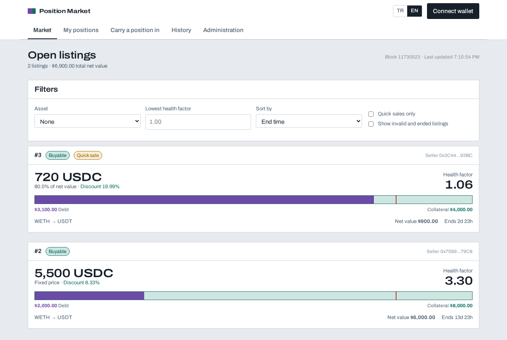
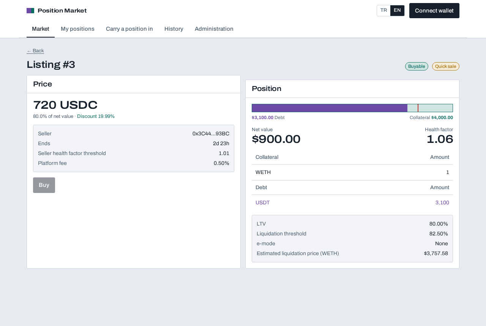
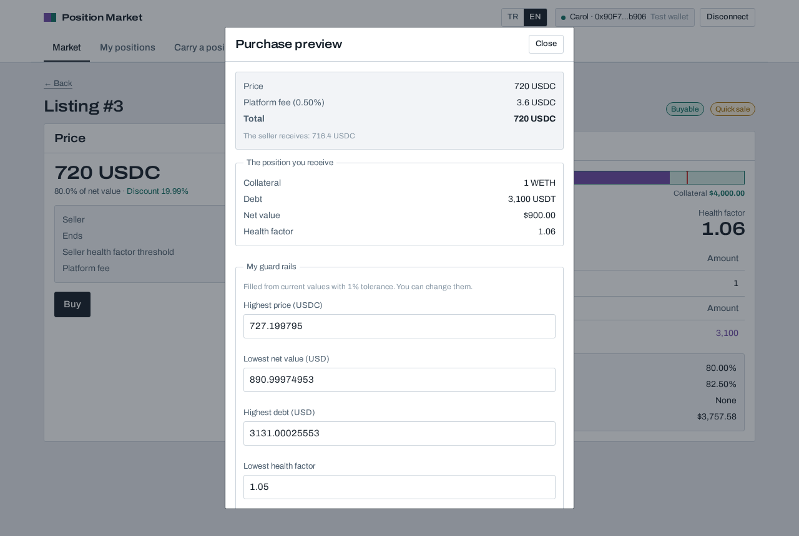
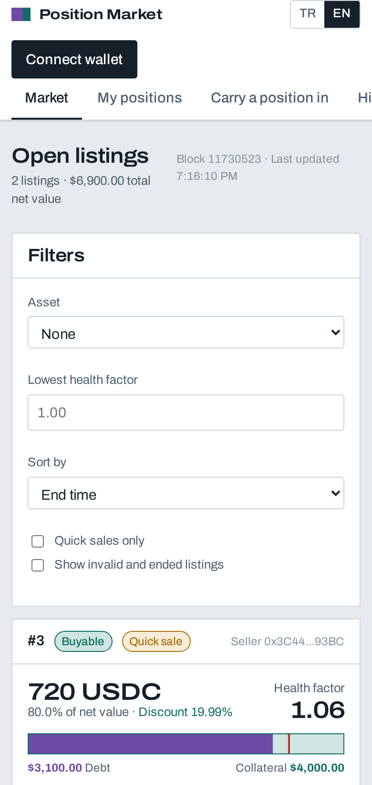

# Aave Position Marketplace

Sell an Aave borrowing position, collateral and debt together, without closing it. The buyer takes
over the position exactly as it stands. Payment and ownership move in the same transaction, or
neither moves.

Aave debt tokens cannot be transferred, so a leveraged position normally cannot change hands at
all. The usual workaround is to unwind: repay the debt, withdraw the collateral, and let the buyer
rebuild the same position from scratch. That costs slippage, gas and the entry price. This project
removes the workaround. Every tradable position lives in its own contract account, and an ERC-721
token says who owns that account, so selling the position is just selling the token. Moving an
existing Aave position in or out uses a debt mode flash loan, which carries the debt across in one
transaction and costs no premium. While a position is listed, the ownership token sits in escrow,
and that single fact is what stops the seller from weakening what the buyer is looking at.

Everything runs against the **live Aave V3 market**: locally as a pinned fork of Sepolia, and on
the public Sepolia testnet through the same contracts.



## Contents

- [How it works](#how-it-works)
- [Run it locally](#run-it-locally)
- [Try the whole flow](#try-the-whole-flow)
- [Testing](#testing)
- [Live on Sepolia](#live-on-sepolia)
- [Hosting it](#hosting-it)
- [Project layout](#project-layout)
- [Documentation](#documentation)

## How it works

```
Interface (React + viem)          reads through the indexer, or straight from the chain
        │
        ├── Server (Node + viem)  indexes chain logs into memory, serves listings and history
        │
        └── Contracts
              PositionManager     ERC-721 ownership, position management, migration in and out
              Marketplace         escrow, listing, pricing, purchase, fee, emergency stop
              PositionAccount     one isolated Aave account per position
                    │
                    └── Aave V3   Pool · Oracle · aToken · VariableDebtToken · Faucet
```

Three ideas carry the design.

**One account per position.** Aave tracks risk per address, so each position gets its own account
and keeps its own health factor, e-mode and collateral flags. Ownership is an ERC-721 token. A sale
moves the token, so a purchase only reads from Aave and never writes to it.

**Escrow is the lock.** While the token sits in the marketplace, `PositionManager` refuses
withdrawals, new borrows and e-mode changes, and still allows supply and repay. There is no second
lock flag that could drift out of step with the first.

**The chain decides.** The interface and the indexer only inform. Every guard rail a buyer sets is
checked inside the buy transaction, against state read at that moment.



## Run it locally

You need **Node 22 or newer**, **git**, and **Foundry**. The scripts run on Linux and macOS.

```bash
curl -L https://foundry.paradigm.xyz | bash && foundryup
```

Open a new terminal after `foundryup`, so that `forge`, `cast` and `anvil` are on your `PATH`.
On macOS, `brew install node` gives you Node. Then:

```bash
git clone https://github.com/ginnun/aave-position-marketplace.git
cd aave-position-marketplace
cp .env.example .env
npm run setup     # packages, contract dependencies, a fork block, contract interfaces
npm run dev       # local chain, indexer, interface
```

Open **http://127.0.0.1:5173**, press **Connect wallet**, and pick **Test wallet**. No browser
extension is needed: the interface carries a wallet that uses the local chain's ready made
accounts, named Deployer, Alice, Bob and Carol.

The local chain is a fork of Sepolia pinned to one block, so the real Aave market is there with its
real reserve configuration. Four example positions are created for you:

| Position | Owner | Shape | State |
|---|---|---|---|
| 1 | Alice | 3 WETH against USDT, health factor 3.30 | not listed |
| 2 | Alice | 2 WETH against USDT | listed at 5,500 USDC |
| 3 | Bob | 1 WETH against USDT, health factor 1.06 | quick sale at 80% of net value |
| 4 | Carol | WETH and LINK against USDT and DAI | not listed |

Bob also keeps a plain Aave position, so you can try carrying one in right away.

The public endpoint keeps only recent state, so a pinned block goes stale after some days. If the
chain fails to start with `state at block ... is pruned` (error code `-32603`), pin a fresh block
and rebuild:

```bash
./scripts/pin.sh && npm run reset
```

The same fix applies to a `.env` copied from another machine, because it carries that machine's
old block. If `pin.sh` itself fails, the endpoint is not serving state at all right now. Wait a
minute and run it again, or put another Sepolia endpoint in `SEPOLIA_RPC_URL` in `.env`.

## Try the whole flow

1. Connect as **Bob**, open **Carry a position in**, approve WETH and carry the position in. One
   transaction moves the collateral and the debt.
2. Open **My positions**, pick the new one, and list it.
3. Connect as **Alice** and buy it from **Market**. The guard rails fill themselves from values
   read from the chain a moment earlier.
4. Back as Alice, open the position and **Carry back to my account**.



The purchase dialog is where the design shows. Before it opens, the interface reads the price and
the position from the chain again and says so if anything moved. The guard rails below are checked
by the contract, not by the page: if the price climbed, the net value fell, the debt grew, the
health factor dropped, or the transaction sat too long in the queue, the purchase is refused and
the interface names the guard rail that stopped it.

To watch the risk machinery work, from another terminal:

```bash
npm run price WETH 2500   # position 3 falls under its threshold and stops being buyable
npm run price WETH 4000   # it recovers
npm run warp 7d           # the clock moves forward and listings pass their end time
```

## Testing

```bash
npm run test            # both suites
npm run test:contracts  # contracts, against a pinned fork of the live Aave market
npm run test:e2e        # browser, headless, on a chain rebuilt from scratch
```

For the browser suite you also need a browser once: `npx playwright install chromium`.

**64 contract tests** run against the real Aave V3 Sepolia market on a pinned fork, so a passing
test means the real protocol behaved that way. Eight of them are invariants, driven by a handler
that lists, cancels, buys, strengthens, weakens and moves prices at random over 2,048 calls per
run:

- a listed position can only leave escrow to its seller or to a paying buyer
- the seller's share plus the fee equals what the buyer paid, exactly
- the platform holds no user balance between transactions
- a listed position's collateral cannot fall and its debt cannot rise
- escrow and the listing record always agree
- the fee never passes its cap
- every attempt to weaken a listed position was refused by the escrow guard
- a purchase only ever failed for a reason a randomly built purchase can legitimately hit

**25 browser tests** drive the real interface with a wallet, including a live liquidation, a price
fall that invalidates a listing, and an emergency stop. They found six defects that the contract
tests could not see, all listed in [the report](docs/REPORT.md).

## Live on Sepolia

| What | Address |
|---|---|
| PositionManager | [`0xa1cDe4d2D2615C82d57e585Ca72c7680184528D3`](https://sepolia.etherscan.io/address/0xa1cDe4d2D2615C82d57e585Ca72c7680184528D3) |
| Marketplace | [`0x2b8c3987bCd425cEF9245580c7eBFb2797256426`](https://sepolia.etherscan.io/address/0x2b8c3987bCd425cEF9245580c7eBFb2797256426) |
| PositionAccount, the clone template | [`0x06805624794E3dA6A965F76731455D8F0Fbc52D9`](https://sepolia.etherscan.io/address/0x06805624794E3dA6A965F76731455D8F0Fbc52D9) |

All three are verified on the explorer, so you can read the source and call the views there.

Position 1 is listed there: 0.004 WETH against 4 USDT, health factor 3.30, at 90% of net value.
Point the interface at it with `VITE_CHAIN_ID=11155111 npm run build`, or run the indexer against
it with `CHAIN_ID=11155111 RPC_URL=$SEPOLIA_RPC_URL npm run server`.

To deploy your own, put a funded Sepolia key in `DEPLOYER_PRIVATE_KEY` and run
`npm run deploy:testnet`. It checks the balance before it spends anything. Add `ETHERSCAN_API_KEY`
to verify the contracts at the same time. `npm run seed:testnet` then creates an example listing.
Set `SEED_COLLATERAL_WEI` to change its size.

## Hosting it

The interface asks `/api/health` once. When nothing answers, it reads the contracts directly
through a public RPC endpoint instead of through the indexer. A deployment is then a folder of
static files, which every free host will serve, with no process running anywhere:

```bash
VITE_CHAIN_ID=11155111 npm run build   # writes web/dist
```

Activity is the one page that needs the indexer, because reading the whole log history from a
browser is not reasonable. For that, `docker compose up --build` runs the interface and the indexer
together on one port.



## Project layout

```
contracts/   Foundry project: contracts, tests, deployment and seed scripts
server/      Indexer and read API
web/         Interface
e2e/         Playwright browser tests
scripts/     Local environment and deployment commands
docs/        Architecture, decisions, threat model, API, user guide
```

## Documentation

| Document | What is in it |
|---|---|
| [ARCHITECTURE.md](docs/ARCHITECTURE.md) | Components, data flow, trust boundaries |
| [adr/](docs/adr/) | Every design decision with the options weighed against it |
| [THREAT_MODEL.md](docs/THREAT_MODEL.md) | Fifteen threats and what answers each one |
| [TRACEABILITY.md](docs/TRACEABILITY.md) | Every story mapped to the test that proves it |
| [API.md](docs/API.md) | The read API, with a working bot that watches and buys |
| [USER_GUIDE.md](docs/USER_GUIDE.md) | Every user flow |
| [ASSUMPTIONS.md](docs/ASSUMPTIONS.md) | Every judgment call and its basis |
| [SUGGESTIONS.md](docs/SUGGESTIONS.md) | What a production deployment would still need |
| [STATIC_ANALYSIS.md](docs/STATIC_ANALYSIS.md) | Every linter warning, fixed or justified |
| [research/aave-testnet.md](docs/research/aave-testnet.md) | What was measured on chain, and the limits found |
| [REPORT.md](docs/REPORT.md) | What was built, what the tests found, what is left |
| [MACOS_AGENT_PROMPT.md](docs/MACOS_AGENT_PROMPT.md) | A prompt that has a coding agent set the project up on a Mac |

## Safety

This is a testnet project and it has not been audited. Do not deploy it to a network that holds
real money. `docs/SUGGESTIONS.md` lists what would have to change first, starting with a pull
payment model and a fresh look at the oracle staleness assumptions.

## License

[MIT](LICENSE)
